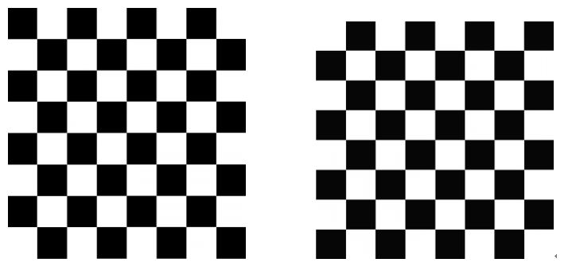

📅 Date: 2020-12-27 (일)

# 1018. 체스판 다시 칠하기
출처: https://www.acmicpc.net/problem/1018

## 📝 Problem

### 문제
지민이는 자신의 저택에서 MN개의 단위 정사각형으로 나누어져 있는 M*N 크기의 보드를 찾았다. 어떤 정사각형은 검은색으로 칠해져 있고, 나머지는 흰색으로 칠해져 있다. 지민이는 이 보드를 잘라서 8*8 크기의 체스판으로 만들려고 한다.

체스판은 검은색과 흰색이 번갈아서 칠해져 있어야 한다. 구체적으로, 각 칸이 검은색과 흰색 중 하나로 색칠되어 있고, 변을 공유하는 두 개의 사각형은 다른 색으로 칠해져 있어야 한다. 따라서 이 정의를 따르면 체스판을 색칠하는 경우는 두 가지뿐이다. 하나는 맨 왼쪽 위 칸이 흰색인 경우, 하나는 검은색인 경우이다.

보드가 체스판처럼 칠해져 있다는 보장이 없어서, 지민이는 8*8 크기의 체스판으로 잘라낸 후에 몇 개의 정사각형을 다시 칠해야겠다고 생각했다. 당연히 8*8 크기는 아무데서나 골라도 된다. 지민이가 다시 칠해야 하는 정사각형의 최소 개수를 구하는 프로그램을 작성하시오.

### 입력
첫째 줄에 N과 M이 주어진다. N과 M은 8보다 크거나 같고, 50보다 작거나 같은 자연수이다. 둘째 줄부터 N개의 줄에는 보드의 각 행의 상태가 주어진다. B는 검은색이며, W는 흰색이다.

### 출력
첫째 줄에 지민이가 다시 칠해야 하는 정사각형 개수의 최솟값을 출력한다.

## Input/Output example
### Input

```
8 8
WBWBWBWB
BWBWBWBW
WBWBWBWB
BWBBBWBW
WBWBWBWB
BWBWBWBW
WBWBWBWB
BWBWBWBW
```

### Output
```
1
```

# ✅ Submit
## 👌 Solved Code 

### 💡 Idea
시간복잡도를 계산해보니 모든 경우를 해봐도 50*50*8*8 이여서 2초안에는 충분하다는 결론이 나왔다.  

우선 보드를 2차원배열에 담은 다음에, 모든 가능한 보드에 대해 체스판(8*8 사이즈)을 세팅해본다. 체스판을 기준으로 x좌표와 y좌표의 합을 2로 나눈 나머지가 0일때는 체스판의 왼쪽위와 색깔이 같아야하고, 나머지가 1일때는 달라야한다.

### 💻 Code

``` python
import sys

N, M = map(int, sys.stdin.readline().split())
board = [list(input()) for _ in range(N)]

min_count = 1000000
count = 0

for i in range(0, N-7):
  for j in range(0, M-7):
    if(board[i][j] == 'W'):
      for y in range(0, 8):
        for x in range(0, 8):
          if((x+y) % 2 == 0 and board[i+y][j+x] != 'W'): count += 1
          if((x+y) % 2 != 0 and board[i+y][j+x] != 'B'): count += 1
    else:   # board[i][j] == 'B'
      for y in range(0, 8):
        for x in range(0, 8):
          if((x+y) % 2 == 0 and board[i+y][j+x] != 'B'): count += 1
          if((x+y) % 2 != 0 and board[i+y][j+x] != 'W'): count += 1
    min_count = min(min_count, count, 64-count)
    count = 0

print(min_count)
```

### ✍ Solution
체스판이 8*8 사이즈이므로 체스판의 왼쪽위의 좌표 설정을 i,j 로 했다. `board[i][j] == 'W'` 일 때와 `board[i][j] == 'B'` 일 때를 나눠서 계산한다.  

<p align='center'></p>

주의할 점은 이렇게만 조건을 나누고, count 를 계산한다면 체스판 왼쪽위에 대해 고정된(주어진) 색깔으로만 고려하는 것이다.(위 사진 중 1가지만 고려하는 것!) 체스판의 색깔이 정반대로도 칠해질 수 있으므로 `64-count` 와도 비교를 해야한다.

### 💬 Commentary
- 맨 처음에 제출하고 틀렸다고 해서 반례들을 찾아봤는데 나는 체스판의 경우 중 1가지로만 결과를 도출하고 있었다. 따라서 최솟값을 계산할 때, `64-count` 를 추가해주니 정답처리가 됐다. 
- 케이스가 2가지인데 `(케이스1) + (케이스2) = 64` 이므로 굳이 다른 케이스를 직접 구하지 않고 뺄셈을 이용하는 아이디어 good

<br>

## References
- [BOJ 1018](https://jaemin8852.tistory.com/249) -> 이 게시물보고 틀린 이유 알게됨
