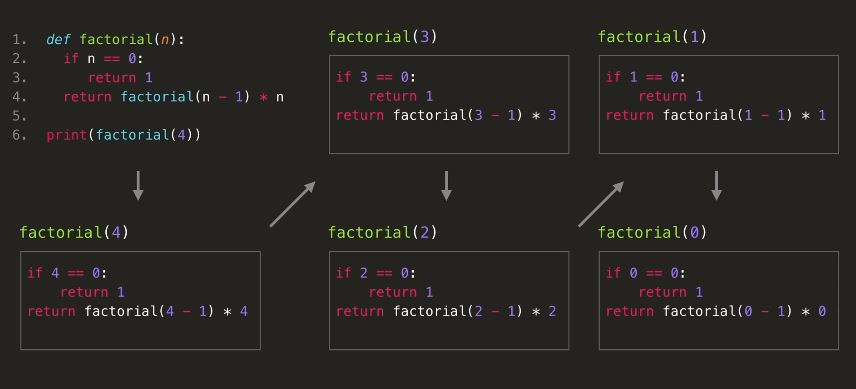

📅 Date: 2020-12-25 (금)

# 재귀 (Recursive)

## 🔎 개념

간단히 정의하면 함수에서 자기 자신을 다시 호출하여 작업을 수행하는 방식이다.  

실제 알고리즘에서 재귀를 활용하는 방식으로는  **어떤 문제를 해결하기 위해 동일한 문제의 조금 더 작은 경우를 해결**함으로써 그 문제를 해결하는 방식이다.

<p align='center'></p>

이해를 돕기위해, 위에 보이는 사진 속 직사각형의 문 하나를 함수, 문을 여는 것을 함수 실행, 문을 닫는 것을 함수 종료라고 가정해보자. 재귀를 사용하면 하나의 문 속에 또 다른 문을 계속해서 여는 것이다.  
 **이때 이전 함수는 종료되지 않고 계속 실행중이다.**  
 그렇게 계속 문을 열다보면 마지막 문이라는 신호(원하는 값을 찾게 됨)를 받게 되고, 그때부터는 이제 가장 마지막에 연 문부터 차레대로 닫고 나오면 된다.  

 방금 비유한 설명을 팩토리얼 재귀구현의 실제 콜스택으로 보면 아래와 같다.
 <p align='center'></p>

<br>

 ## 재귀 구현 시 주의사항

1. **탈출 조건(base case)을 걸어서 재귀호출을 끝내야 한다는 것**
2. **재귀 함수에 들어가는 파라미터 값이 계속해서 변해야 한다는 것**

1번의 탈출 조건이 없으면 함수가 무한 루프를 돌게 되고, 마찬가지로 2번에서 파라미터 값이 계속 동일하다면 이 역시 함수가 무한 루프를 돌게 될 것이다.  

재귀함수를 구현 할 때, 이 2가지 조건은 항상 충족되어야 한다.

> * Recursive case: 현 문제가 너무 커서, 같은 형태의 더 작은 부분 문제를 재귀적으로 푸는 경우  
> * Base case: 이미 문제가 충분히 작아서, 더 작은 부분 문제로 나누지 않고도 바로 답을 알 수 있는 경우

<br>

## 재귀 vs 반복문

재귀로 짠 코드는 반복문으로도 짤 수 있고, 반대로 반복문으로 짠 코드는 재귀로도 짤 수 있다.  
반복문을 쓰는 게 더 가독성이 좋고 효율적이면 반복문을 쓰면 되고, 재귀를 쓰는 게 더 가독성이 좋고 효율적이면 재귀를 쓰면 된다.  

다만 재귀를 너무 많이 호출하면 콜 스택이 계속 쌓이므로 stack overflow 가 발생할 수도 있고, 메모리를 계속 사용하기 때문에 반복문보다 성능이 좋지 않다.
> ❗ 하지만 **꼬리재귀(Tail recursion)** 방식을 사용한다면 성능도 챙기면서 가독성도 챙길 수 있다.  

<br>

> 💡 **꼬리재귀(Tail recursion)** 방식이란?  
return 문에서 재귀 호출 시, 추가 연산을 하지 않고 재귀함수만을 return 해서 기존 스택을 재활용할 수 있다. 컴파일러 별로 꼬리 재귀 최적화 설정이 있으므로 설정을 미리 확인해봐야한다.

그렇다면 반복문으로도 짤 수 있는 코드를 왜 굳이 재귀를 이용하는걸까?

1. 알고리즘을 그대로 코드 상으로 자연스럽게 표현할 수 있다. (점화식, 분할정복 등등..)
2. 반복문으로 짤 수는 있지만 구현하기 어려운 것들을 재귀로는 굉장히 간단히 구현할 수 있다. (quick sort, 하노이의 탑 등등..)
3. 변수 사용을 줄여줄 수 있어서, 프로그램이 정상적으로 돌아가는지에 대한 증명이 쉬워진다. 즉, 사용하는 변수가 적기 때문에 side effect 가 적어진다.
4. 앞서 말했던 **꼬리재귀(Tail recursion)**을 사용하게 되면, 성능은 반복문과 다를 바 없는데 코드 상 가독성까지 높일 수 있다.

<br>

## 📝 재귀호출을 이용한 팩토리얼 예제

### ✅ 일반적인 재귀 방식

```python
def factorial(n):
  if(n == 0):   # base case ( n == 0 )
    return 1
  else:         # recursive case ( n > 0 )
    return n * factorial(n-1) 

print(factorial(4))
```

> factorial 함수에서 이전 스택의 리턴 값을 계속 사용하기 때문에 이런 경우는 return 문을 반드시 사용해줘야 한다. return 없으면 에러

 <p align='center'></p>

<br>

### ✅ 꼬리 재귀 방식

> 안타깝게도 파이썬 인터프리터는 꼬리 재귀 호출 최적화를 지원하지 않기 때문에 파이썬에서는 의미가 없고, 꼬리재귀를 지원하는 C, C++ 언어 등을 사용하고 컴파일러에서 최적화 설정을 해줘야 한다.

```C 
#include <stdio.h>

int FactorialTail(int n, int acc){  // acc : accumulator
	if (n == 1) return acc;
	return FactorialTail(n - 1, acc * n);    //  일반 재귀에서의 n * Factorial(n-1)와 달리 반환값에서 추가 연산을 필요로 하지 않음
}

int Factorial(int n){
  return FactorialTail(n, 1);
}

int main(){
  int result = Factorial(4);
  
  printf("%d", result);
  return 0;
}

```

* 일반적인 재귀 방식과는 다르게 acc 라는 값을 저장하는 변수를 사용하기 때문에 재귀호출을 하게 되는 return 문에서  재귀함수만을 실행하고 있다.
* return 문에서 함수 호출 외에 추가 연산을 하지 않기 때문에 콜 스택을 쌓지 않고 재활용한다.
  
아래의 컴파일러가 해석하는 코드를 보면 일반 재귀호출 과 꼬리 재귀호출의 차이를 더 쉽게 이해할 수 있다.

**컴파일러가 해석하는 일반 재귀호출 코드**

```python
def factorial(n):
  if(n == 0):   # base case ( n == 0 )
    return 1
  else:         # recursive case ( n > 0 )
    result = factorial(n-1)
    return n * result 

print(factorial(4))
```

**컴파일러가 해석하는 꼬리 재귀호출 코드**

```C
 // C언어
 int FactorialTail(int n,int acc){
	do{
		if (n == 1) return;
		acc = acc * n;
		n = n - 1;
	} while (true);
}
```

보다시피 꼬리 재귀를 사용하게 되면, 재귀호출을 함에도 불구하고 컴파일러는 반복문 형태로 해석하게 된다. 따라서 일반 재귀의 단점인 콜 스택 메모리와 stack overflow 문제를 해결할 수 있다.

<br>

## 재귀함수의 시간복잡도 측정

재귀함수의 시간복잡도 계산 : **(base case의 시간복잡도)** * **(recursive case의 시간복잡도)**

* **팩토리얼 재귀 방식의 시간복잡도**
  ```py
  def factorial(n):
  if(n == 0):   # base case ( n == 0 )
    return 1
  else:         # recursive case ( n > 0 )
    return n * factorial(n-1) 

  print(factorial(4))
  ```
  
  * base case : O(1)
  * recursive case : O(n) (n번 재귀호출)
  * 총 시간복잡도 : O(n)

* **피보나치 재귀 방식의 시간복잡도**
  ```py
  def fib(n):
  if(n == 1 or n == 2):   # base case
    return 1
  else:                   # recursive case
    return fib(n-1) + fib(n-2)

  for i in range(1,11):
    print(fib(i))
  ```
  
  * base case : O(1)
  * recursive case : O(2^n) (2^(n-2)번 재귀호출)
  * 총 시간복잡도 : O(2^n)


## References
- [[개념 이해] 재귀 함수 recursion](https://medium.com/@yejinh/%EA%B0%9C%EB%85%90-%EC%9D%B4%ED%95%B4-%EC%9E%AC%EA%B7%80-%ED%95%A8%EC%88%98-recursion-7676d1ed4d6f)
- [KLDP 질문글](https://kldp.org/node/134556)
- [꼬리 재귀 최적화(Tail Recursion)](https://bozeury.tistory.com/entry/%EA%BC%AC%EB%A6%AC-%EC%9E%AC%EA%B7%80-%EC%B5%9C%EC%A0%81%ED%99%94Tail-Recursion)